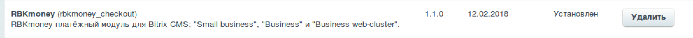
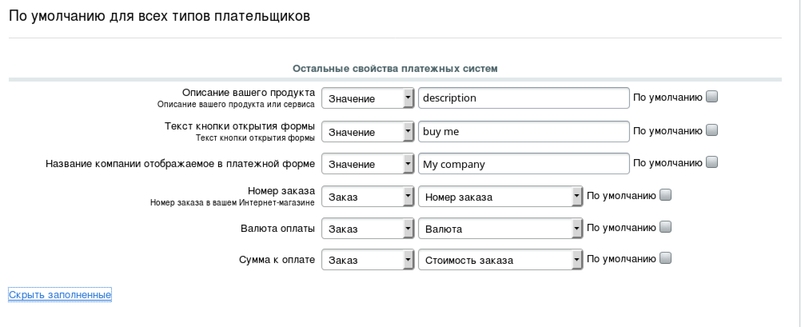

# rbkmoney-cms-bitrix

### Установка и настройка модуля

1) Скопируйте папку `rbkmoney_payment` и все ее содержимое на ваш сервер в `\bitrix\modules\`
2) Найдите модуль `«RBKmoney (rbkmoney_payment)` и установите его.



1)	Перейдите в «Магазин» -> «Платежные системы» и нажмите на кнопку «Добавить платежную систему»
1)	Заполните данные в открывшемся окне:



В качестве `Callback Url`-а для обработки уведомления от платежной системы в личном кабинете укажите URL:

```
http://<your-bitrix-site>//personal/order/rbkmoney_payment/notification.php
```

3)	Заполните оставшиеся поля и нажмите кнопку «Применить»:
В поля «Публичный ключ для авторизации уведомлений о статусе оплаты», «Приватный ключ для проведения оплаты», «Номер магазина в системе RBKmoney» впишите из Личного Кабинета Мерчанта https://dashboard.rbk.money

В поле «Моя компания» укажите название компании, которое будет отображаться в платежной форме.
